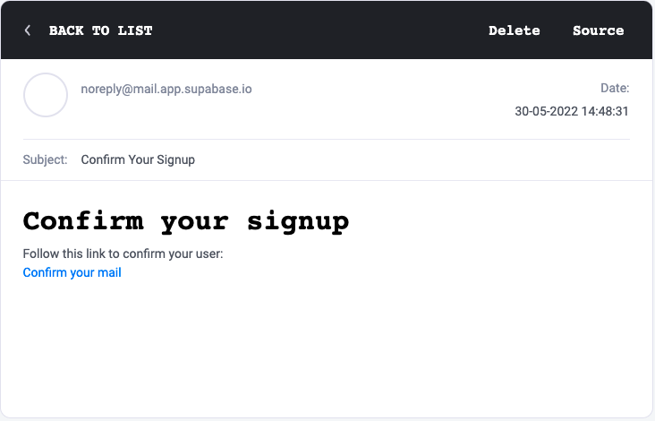

**Milestone I Submission**

**Team Name:**

TeaHub

**Proposed Level of Achievement:**

Apollo 11 

**Motivation**

Many students regret not studying hard enough after receiving their results at the end of the semester. However, they lack the discipline to stay focused during the semester and often find themselves unable to stay focused or procrastinate their work. We hope to help students concentrate and study better by creating an app called TeaHub where students are able to gain a sense of achievement from focusing and completing their work. 

In the process of developing TeaHub, we hope to gain knowledge of mobile app development, frontend and backend development and mastery in various programming languages. 

As we believe that peer pressure can push students to work harder, TeaHub aims to promote healthy competition among friends to encourage students to study. We hope that students using TeaHub are able to improve their grades through focusing during their study time and gain a sense of accomplishment through looking at their progress. 

**Aim**

TeaHub will be a mobile app that discourages users from using their mobile phone for the duration that they set.

As many students find themselves zoning off 1 hour into lectures and start using their phones, TeaHub aims to help students stay concentrated when attending classes or when they are studying. 

TeaHub aims to let users gain a sense of achievement after they have accomplished the goal they have set for themselves in the beginning, (i.e. not using their phone for the duration that they have set) through various reward systems.

.

**User Stories**

1. As a student who is revising for exams, I want to be able to set a timer for myself to stay focused, and reward myself for being focused and productive. 
2. As a student who has completed my study goals for the day, I want to be rewarded with incentives to stay motivated. 
3. As a student studying with my friends, I want to stay focused together with my friends while studying and make sure no one gets distracted by our phones.
4. As a student with friends, I want to remind my friends if I see that they are lagging behind in their studies. 
5. As a student, I want an app that helps to keep track of my To-Dos.
6. As a student, I want to know how long I have stayed focused for at the end of a day. 
7. As a student, I want to know how much time my friends stay focused for in a day. 

**Features**

User Account

Our users have to create an account with their email address in order to use TeaHub. 

An email with a verification link will be sent to the email address. Upon clicking on the verification link, the user’s email will be verified and the account is successfully created. 

The user will be able to set their username and upload a profile picture. Account details such as password, username and profile picture can be updated after account creation. 

The user can log out of the current account. An account can be deleted, and the user will be automatically logged out after account deletion. 

An email account can only be associated with 1 TeaHub account. 

Figure 1: Login/Account creation screen for TeaHub

Figure 2: Account confirmation e-mail sent to verify account.

Figure 3: Updating account particulars upon confirmation of account.

Ordering (Setting the timer) 

Users can order bubble tea, choosing the flavor and the collection time. (aka setting timer) 

Once the user confirms the order (aka start the timer), the screen will show an empty bubble tea cup starting to fill slowly with the bubble tea flavor that the user has chosen. 

While the cup is being filled, if the phone is unlocked and is not on the TeaHub app for more than 10 seconds, the tea cup will topple over and a notification will appear, with a message that says that the order was unsuccessful. 

When the timer is up, a notification will be sent with a message saying that the bubble tea is ready for collection. The user can collect the bubble tea and will be rewarded with points for successfully staying focused for the set duration. 

Leaderboard

The user can access the leaderboard which shows the points that the user’s friends have earned that day, week and month. 

Friends

Users can add friends by username through the add friends tab. A user can choose to accept or decline friend requests.

Friends can see each other’s points earned on the leaderboards and can form group sessions to make a Group Order. 

Bulk Orders/ Group Orders 

A user can host a group session and invite up to 4 friends to be in the same session. Users in the same session share the same focus timer and points earned will be multiplied. 

If one of the users in the group fails to stay focused till the end, only that user will have an unsuccessful order. The points multiplier for the other users remaining will be decreased. 

Gacha

A user can unlock new bubble tea flavors by trying their luck in the gacha. Each gacha attempt costs points and subsequent gacha attempts cost an increasing number of points. The cost will reset weekly. 

There will be a limited edition (LE) bubble tea flavor every 2 weeks. LE flavors cannot be acquired after that fortnight. 

List of bubble tea flavors: 

1. Milk tea with pearls
2. Green milk tea 
3. Taro milk tea 
4. Caramel milk tea 
5. Chocolate milk tea 
6. Brown sugar milk tea 
7. Matcha milk tea 
8. Cheese milk tea

**Timeline**

Features to be completed by the mid of June:

User interface with these core features:

1. Timer Allow users to set a countdown timer that will stop if the device is not left idle/used for other purposes.
2. Cloud database Database where a user’s records of past sessions, and total points earned from focus sessions are recorded Respective information and records of added friends are also available Leaderboard that will always show the top global users as well as among friends
3. Adding friends, accepting and declining friend requests.
4. Daily, weekly and monthly Leaderboard display.

Features to be completed by the mid of July:

1. Gacha system A gacha for users to try their luck at for limited edition bubble tea
2. Order Together Friends create and join a room and everyone in the room has to stay focused for the same duration set by the host.

Tech Stack

[Please list down the technologies that you are planning to use.]

1. React Native (Front End)
2. SupaBase (Backend)
3. Postgres Database
